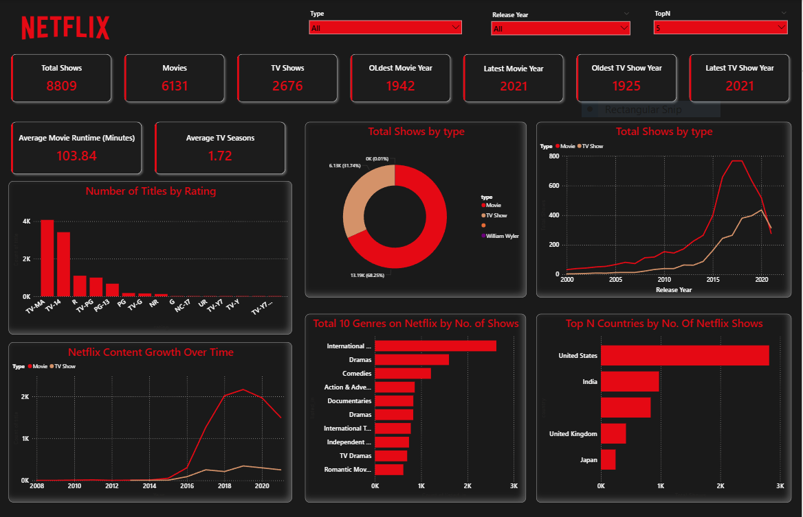

# 🎬 Netflix Power BI Dashboard

This project is a **Power BI dashboard** built using the Netflix Titles dataset.  
The goal of this project is to analyze and visualize Netflix content trends such as **Movies vs TV Shows, genres, release years, ratings, and country-wise insights**.

---

## 📂 Dataset
The dataset used is **Netflix Titles**, which contains:
- Show ID  
- Title  
- Director  
- Cast  
- Country  
- Date Added  
- Release Year  
- Rating  
- Duration  
- Listed In (Genres)  
- Description  

### 🔎 Data Cleaning & Transformation (Power Query)
- Extracted `Duration (minutes)` for Movies.  
- Created `Seasons` column for TV Shows.  
- Split `listed_in` column into multiple genres for better analysis.  
- Handled null values in `Country`, `Date Added`, and `Duration`.  
- Removed irrelevant columns (`Description`) not used in visuals.  

---

## 📊 Dashboard Overview

The dashboard includes the following visuals:

- **KPI Cards**  
  - Total Titles, Movies, TV Shows  
  - Oldest & Latest Release Years  
  - Average Movie Runtime, Average TV Seasons  

- **Charts**  
  - Bar Chart: Number of Titles by Rating  
  - Donut Chart: Movies vs TV Shows distribution  
  - Line Chart: Movies & TV Shows released over time  
  - Bar Chart: Netflix Content Growth by Year  
  - Top 10 Genres on Netflix by No. of Shows  
  - Top Countries by No. of Netflix Shows  

---

## 🚀 Insights
- Netflix hosts **8800+ titles** with more Movies than TV Shows.  
- The **oldest movie** dates back to **1942**, while the **oldest TV show** is from **1925**.  
- The **United States** and **India** are the top producers of Netflix content.  
- Post-2015, Netflix saw massive growth in Movies & TV Shows released.  
- Most Netflix TV Shows have **1–2 seasons**.  
- The **average Netflix movie runtime** is **~104 minutes**.  

---

## 🛠️ Tools Used
- **Power BI** → Dashboard & Visualizations  
- **Power Query** → Data Cleaning & Transformation  
- **CSV (Netflix Titles)** → Source dataset  

---

## 📸 Dashboard Preview

---

## 📌 How to Use
1. Clone or download this repository.  
2. Open the Power BI file (`Netflix_Dashboard.pbix`) in Power BI Desktop.  
3. Explore the interactive visuals and insights.  

---

## ✨ Author
👤 **Sarika Verma**  
📧 *[sarika261028@gmail.com]*  
🔗 *[www.linkedin.com/in/akasarikaverma]*
